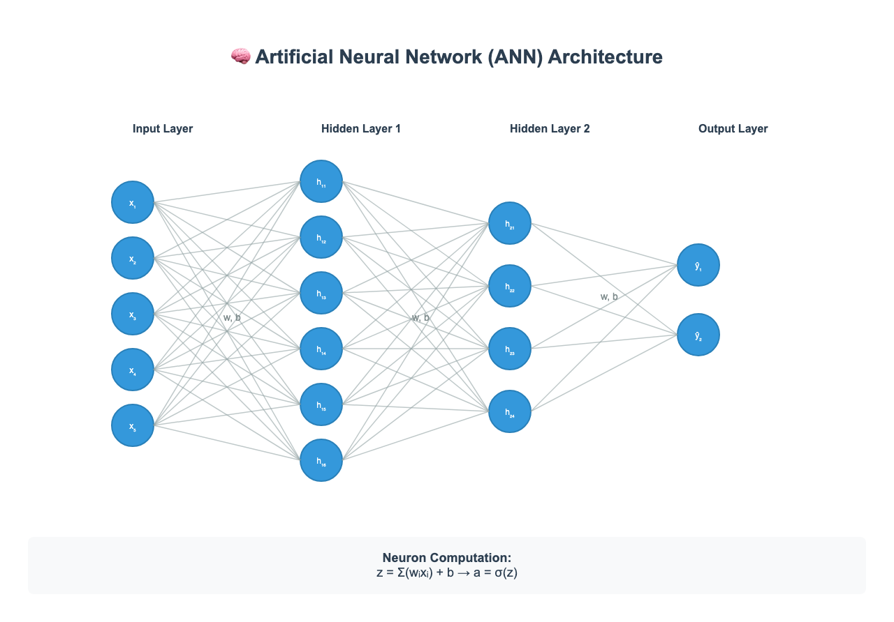
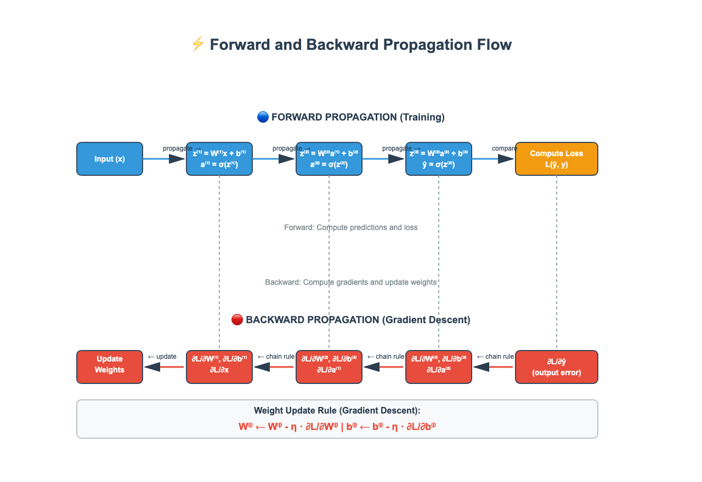
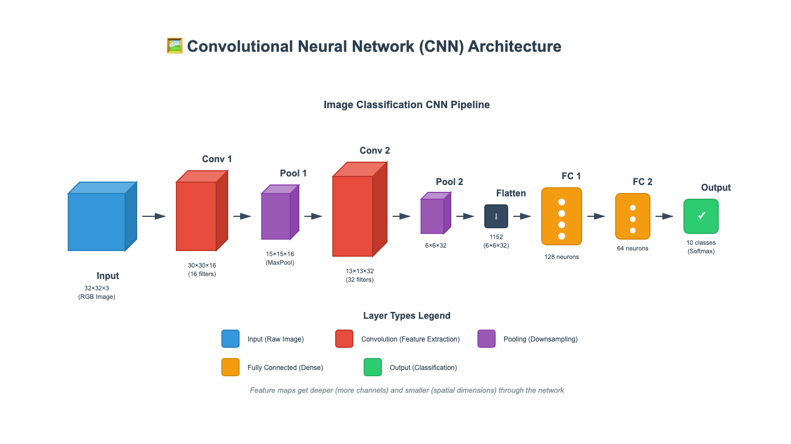
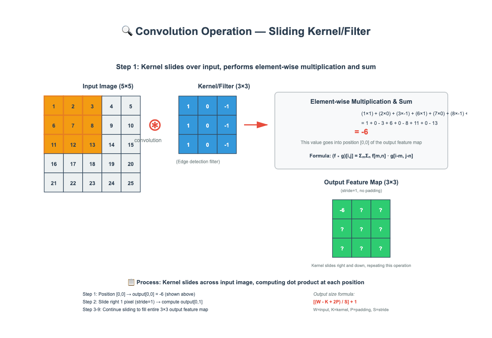
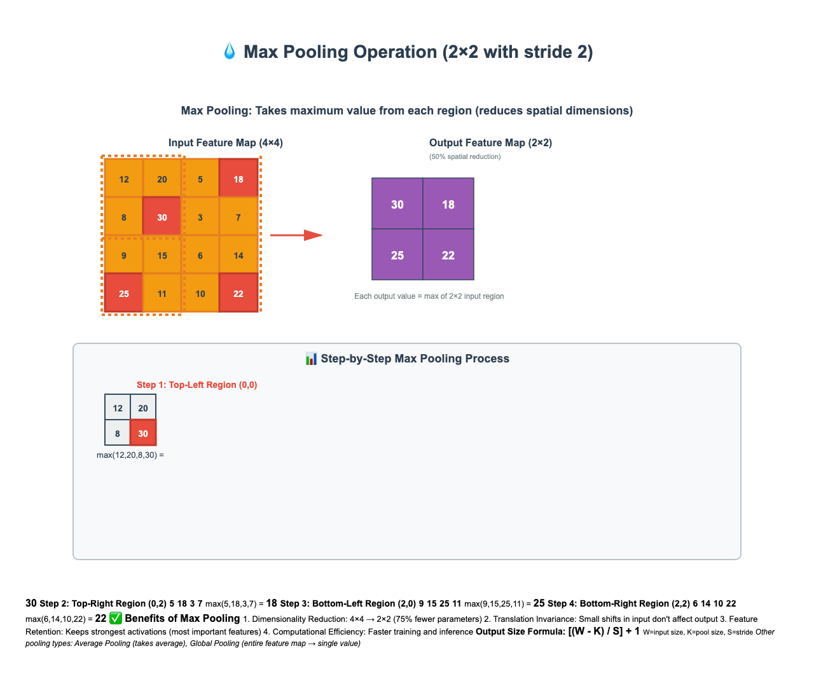

# Deep Learning, ANN & CNN — Comprehensive Cheatsheet

> **Definition:** Deep Learning is a subset of machine learning that uses multi-layered artificial neural networks to automatically learn hierarchical data representations, enabling machines to perform complex tasks like image recognition, natural language processing, and game playing.

---

## 📚 Overview

Deep Learning revolutionized AI by eliminating manual feature engineering. Instead of humans designing features, deep networks learn them automatically through layers of transformations. The "deep" refers to the multiple hidden layers that progressively learn more abstract representations.

**Why It Matters:**
- **Automatic Feature Learning:** No need to manually engineer features
- **Scalability:** Performance improves with more data and compute
- **Versatility:** Applies to images, text, audio, video, and structured data
- **State-of-the-Art:** Achieves human-level or superhuman performance on many tasks

---

## 🧠 Intuition / Analogy

**Learning to Recognize Dogs (Human Brain Analogy):**

Imagine teaching a child to recognize dogs:

1. **Layer 1 (Low-level):** The child first notices basic features — edges, colors, textures ("fuzzy thing", "brown spots")
2. **Layer 2 (Mid-level):** Combines features into parts — "pointy ears", "wet nose", "wagging tail"
3. **Layer 3 (High-level):** Recognizes the complete concept — "That's a dog!"

**Deep Learning works the same way:**
- **Early layers:** Detect edges, colors, simple patterns
- **Middle layers:** Combine into textures, shapes, object parts
- **Deep layers:** Recognize complete objects, scenes, concepts

Each layer builds on the previous one, creating a **hierarchy of features** from simple to complex.

---

## 🏗️ Artificial Neural Network (ANN) Architecture

An ANN is a computational model inspired by biological neurons, consisting of interconnected nodes organized in layers.



### **Core Components**

#### 1. **Neurons (Nodes)**
Each neuron performs:
- **Weighted sum:** $z = \sum_{i=1}^{n} w_i x_i + b$
  - $x_i$: input features
  - $w_i$: weights (learned parameters)
  - $b$: bias (learned offset)
- **Activation:** $a = \sigma(z)$ (non-linear transformation)

#### 2. **Layers**

| Layer Type | Description | Role |
|------------|-------------|------|
| **Input Layer** | Receives raw features | Entry point for data |
| **Hidden Layers** | Transform data through learned representations | Feature extraction & abstraction |
| **Output Layer** | Produces final predictions | Classification/regression output |

#### 3. **Activation Functions**

Activation functions introduce **non-linearity**, enabling networks to learn complex patterns.

| Function | Formula | Range | Use Case |
|----------|---------|-------|----------|
| **ReLU** | $f(x) = \max(0, x)$ | $[0, \infty)$ | Default choice, solves vanishing gradient |
| **Sigmoid** | $f(x) = \frac{1}{1 + e^{-x}}$ | $(0, 1)$ | Binary classification (output layer) |
| **Tanh** | $f(x) = \frac{e^x - e^{-x}}{e^x + e^{-x}}$ | $(-1, 1)$ | Hidden layers (zero-centered) |
| **Softmax** | $f(x_i) = \frac{e^{x_i}}{\sum_{j} e^{x_j}}$ | $(0, 1)$ sum=1 | Multi-class classification |
| **Leaky ReLU** | $f(x) = \max(0.01x, x)$ | $(-\infty, \infty)$ | Prevents dying ReLU problem |

---

## ⚡ How ANN Works — Forward & Backward Propagation



### **Forward Propagation (Prediction)**

**Goal:** Compute predictions from input to output

**Process:**
1. **Input:** Start with features $\mathbf{x}$
2. **Layer-by-layer computation:**
   - $\mathbf{z}^{(l)} = \mathbf{W}^{(l)} \mathbf{a}^{(l-1)} + \mathbf{b}^{(l)}$ (linear transformation)
   - $\mathbf{a}^{(l)} = \sigma(\mathbf{z}^{(l)})$ (activation)
3. **Output:** Final prediction $\hat{y} = \mathbf{a}^{(L)}$
4. **Loss:** Compute error $L(\hat{y}, y)$

**Common Loss Functions:**
- **Mean Squared Error (MSE):** $L = \frac{1}{n}\sum_{i=1}^{n}(y_i - \hat{y}_i)^2$ (regression)
- **Cross-Entropy:** $L = -\sum_{i} y_i \log(\hat{y}_i)$ (classification)

---

### **Backward Propagation (Learning)**

**Goal:** Compute gradients to update weights

**Process (Chain Rule):**
1. **Output gradient:** $\frac{\partial L}{\partial \hat{y}}$ (how loss changes with output)
2. **Propagate backward through layers:**
   $$\frac{\partial L}{\partial \mathbf{W}^{(l)}} = \frac{\partial L}{\partial \mathbf{a}^{(l)}} \cdot \frac{\partial \mathbf{a}^{(l)}}{\partial \mathbf{z}^{(l)}} \cdot \frac{\partial \mathbf{z}^{(l)}}{\partial \mathbf{W}^{(l)}}$$
3. **Weight update (Gradient Descent):**
   $$\mathbf{W}^{(l)} \leftarrow \mathbf{W}^{(l)} - \eta \frac{\partial L}{\partial \mathbf{W}^{(l)}}$$
   $$\mathbf{b}^{(l)} \leftarrow \mathbf{b}^{(l)} - \eta \frac{\partial L}{\partial \mathbf{b}^{(l)}}$$
   - $\eta$: learning rate (step size)

**Optimization Algorithms:**
- **SGD (Stochastic Gradient Descent):** Basic, uses single batch
- **SGD with Momentum:** Accelerates convergence, dampens oscillations
- **Adam:** Adaptive learning rates per parameter (most popular)
- **RMSprop:** Adapts learning rate based on gradient magnitude

---

## 🖼️ Convolutional Neural Network (CNN)

CNNs are specialized neural networks designed for **grid-like data** (images, video, audio spectrograms). They preserve spatial structure and use **parameter sharing** for efficiency.



### **Why CNNs for Images?**

| Feature | ANN | CNN |
|---------|-----|-----|
| **Input Handling** | Flattens image (loses structure) | Preserves 2D/3D spatial structure |
| **Parameters** | Millions (fully connected) | Thousands (parameter sharing) |
| **Translation Invariance** | No (position-dependent) | Yes (detects features anywhere) |
| **Local Patterns** | Ignores spatial proximity | Exploits local connectivity |

**Example:** A 224×224 RGB image:
- **ANN:** 224×224×3 = 150,528 inputs → millions of weights
- **CNN:** Share same filter across image → few thousand weights

---

## 🔍 Key CNN Operations

### **1. Convolution Layer**

**Purpose:** Extract spatial features using learnable filters (kernels)



**How It Works:**
- **Filter/Kernel:** Small matrix (e.g., 3×3, 5×5) with learnable weights
- **Operation:** Slide filter over input, compute dot product at each position
- **Formula:** 
  $$(f \ast g)[i,j] = \sum_{m}\sum_{n} f[m,n] \cdot g[i-m, j-n]$$
- **Output:** Feature map showing where filter "matched"

**Key Parameters:**
- **Filters/Kernels:** Number of different patterns to learn (e.g., 32, 64, 128)
- **Kernel Size:** Receptive field (3×3 most common)
- **Stride:** Step size when sliding (stride=1 → move 1 pixel, stride=2 → skip pixels)
- **Padding:** Add zeros around border to control output size
  - **Valid:** No padding (output smaller)
  - **Same:** Padding to keep same size

**Output Size Formula:**
$$\text{Output Size} = \left\lfloor \frac{W - K + 2P}{S} \right\rfloor + 1$$
- $W$: input width/height
- $K$: kernel size
- $P$: padding
- $S$: stride

**What Filters Learn:**
- **Early layers:** Edges (horizontal, vertical, diagonal), colors, gradients
- **Middle layers:** Textures, patterns, shapes
- **Deep layers:** Object parts, faces, complex concepts

---

### **2. Pooling Layer**

**Purpose:** Downsample feature maps, reduce computation, provide translation invariance



**Types:**

| Type | Operation | Use Case |
|------|-----------|----------|
| **Max Pooling** | Take maximum value in region | Most common, preserves strongest features |
| **Average Pooling** | Take average of region | Smoother downsampling |
| **Global Average Pooling** | Average entire feature map → single value | Replace flatten + FC for efficiency |

**Common Configuration:** 2×2 window, stride=2 (50% reduction in each dimension)

**Benefits:**
- Reduces spatial dimensions (fewer parameters, faster training)
- Translation invariance (small shifts don't affect output)
- Keeps strongest activations (most important features)
- Prevents overfitting by reducing parameters

---

### **3. Batch Normalization**

**Purpose:** Normalize layer inputs to stabilize and accelerate training

**Formula:**
$$\hat{x} = \frac{x - \mu}{\sqrt{\sigma^2 + \epsilon}}$$
$$y = \gamma \hat{x} + \beta$$

**Benefits:**
- Faster convergence (higher learning rates possible)
- Reduces internal covariate shift
- Mild regularization effect
- Less sensitive to weight initialization

---

### **4. Dropout**

**Purpose:** Prevent overfitting by randomly dropping neurons during training

**Process:**
- During training: Randomly set fraction $p$ of neurons to 0 (typical: $p=0.5$)
- During inference: Use all neurons (scaled by $p$)

**Benefits:**
- Forces network to learn redundant representations
- Acts as ensemble of networks
- Reduces overfitting significantly

---

## 🏛️ Complete CNN Architecture

**Typical CNN Flow:**
```
Input Image 
  ↓
[Conv → ReLU → BatchNorm → Pool] × N layers
  ↓
Flatten (convert 3D → 1D)
  ↓
[Dense → ReLU → Dropout] × M layers
  ↓
Output Layer (Softmax/Sigmoid)
```

**Example: Image Classification (CIFAR-10)**
```
Input: 32×32×3 RGB image
  ↓
Conv1: 32 filters, 3×3 → 32×32×32
ReLU + MaxPool 2×2 → 16×16×32
  ↓
Conv2: 64 filters, 3×3 → 16×16×64
ReLU + MaxPool 2×2 → 8×8×64
  ↓
Conv3: 128 filters, 3×3 → 8×8×128
ReLU + MaxPool 2×2 → 4×4×128
  ↓
Flatten → 2048 features
  ↓
Dense: 256 neurons + ReLU + Dropout(0.5)
  ↓
Output: 10 classes (Softmax)
```

---

## 🆚 ANN vs CNN Comparison

| Aspect | ANN (Fully Connected) | CNN (Convolutional) |
|--------|----------------------|---------------------|
| **Best For** | Tabular data, sequences, small datasets | Images, spatial data, large visual datasets |
| **Input Type** | 1D vectors (flattened) | 2D/3D arrays (preserves structure) |
| **Connectivity** | Every neuron connects to every neuron | Local receptive fields |
| **Parameters** | Very high (millions) | Low (parameter sharing) |
| **Spatial Structure** | Lost (flattening destroys locality) | Preserved (spatial relationships maintained) |
| **Translation Invariance** | No (position-sensitive) | Yes (filter slides across image) |
| **Training Speed** | Slower (more parameters) | Faster (fewer parameters, GPU-optimized) |
| **Overfitting Risk** | High (many parameters) | Lower (weight sharing + pooling) |
| **Typical Use Cases** | House price prediction, loan approval, recommendation | Image classification, object detection, segmentation |

**When to Use:**
- **ANN:** Non-spatial data (customer features, sensor readings, embeddings)
- **CNN:** Any grid-like data with spatial structure (images, video frames, spectrograms)

---

## 🏆 Famous CNN Architectures

### **1. LeNet-5 (1998)**
- **Purpose:** Handwritten digit recognition (MNIST)
- **Architecture:** 2 Conv layers + 2 FC layers
- **Innovation:** First successful CNN application
- **Layers:** Conv → Pool → Conv → Pool → FC → FC → Output

### **2. AlexNet (2012)**
- **Purpose:** ImageNet classification (1000 classes)
- **Architecture:** 5 Conv + 3 FC layers (60M parameters)
- **Innovation:** Won ImageNet by large margin, popularized deep learning
- **Key Features:** ReLU, dropout, data augmentation, GPU training

### **3. VGG-16/19 (2014)**
- **Purpose:** Deep image classification
- **Architecture:** 16-19 layers, all 3×3 filters
- **Innovation:** Showed depth matters, simple consistent design
- **Key Features:** Small filters, deep network, easy to understand

### **4. ResNet (2015)**
- **Purpose:** Very deep networks (50, 101, 152 layers)
- **Architecture:** Residual blocks with skip connections
- **Innovation:** Solved vanishing gradient in very deep networks
- **Key Formula:** $y = F(x) + x$ (residual learning)
- **Impact:** Enabled 1000+ layer networks

### **5. Inception/GoogLeNet (2014)**
- **Purpose:** Efficient multi-scale feature extraction
- **Architecture:** Parallel conv layers with different kernel sizes
- **Innovation:** 1×1 convolutions for dimensionality reduction
- **Key Features:** Multi-scale processing, computational efficiency

### **6. MobileNet (2017)**
- **Purpose:** Efficient CNNs for mobile devices
- **Architecture:** Depthwise separable convolutions
- **Innovation:** 90% fewer parameters with similar accuracy
- **Use Case:** Edge devices, real-time mobile apps

### **7. EfficientNet (2019)**
- **Purpose:** Scalable, efficient CNNs
- **Architecture:** Compound scaling (depth + width + resolution)
- **Innovation:** Balances network dimensions optimally
- **Result:** State-of-the-art accuracy with 10× fewer parameters

---

## 🔑 Key Formulas

### **Neuron Computation**
$$z = \sum_{i=1}^{n} w_i x_i + b$$
$$a = \sigma(z)$$

### **Convolution Operation**
$$(f \ast g)[i,j] = \sum_{m=0}^{k-1}\sum_{n=0}^{k-1} f[m,n] \cdot g[i+m, j+n]$$

### **Convolution Output Size**
$$\text{Output} = \left\lfloor \frac{W - K + 2P}{S} \right\rfloor + 1$$

### **Pooling Output Size**
$$\text{Output} = \left\lfloor \frac{W - K}{S} \right\rfloor + 1$$

### **Backpropagation (Chain Rule)**
$$\frac{\partial L}{\partial w^{(l)}} = \frac{\partial L}{\partial a^{(l)}} \cdot \frac{\partial a^{(l)}}{\partial z^{(l)}} \cdot \frac{\partial z^{(l)}}{\partial w^{(l)}}$$

### **Gradient Descent Update**
$$w \leftarrow w - \eta \frac{\partial L}{\partial w}$$

### **Adam Optimizer (Adaptive Moment Estimation)**
$$m_t = \beta_1 m_{t-1} + (1-\beta_1)g_t$$
$$v_t = \beta_2 v_{t-1} + (1-\beta_2)g_t^2$$
$$w \leftarrow w - \eta \frac{m_t}{\sqrt{v_t} + \epsilon}$$

---

## ✅ When to Use / ❌ When NOT to Use

### **When to Use Deep Learning**

| Scenario | Why |
|----------|-----|
| ✅ Large datasets (>10K samples) | Deep networks need data to learn patterns |
| ✅ High-dimensional data (images, text) | Automatic feature learning excels |
| ✅ Complex patterns (non-linear) | Multiple layers model complexity |
| ✅ GPU/TPU available | Parallelizable operations benefit from hardware |
| ✅ End-to-end learning needed | No manual feature engineering |

### **When NOT to Use Deep Learning**

| Scenario | Alternative |
|----------|-------------|
| ❌ Small datasets (<1K samples) | Traditional ML (Random Forest, SVM, XGBoost) |
| ❌ Tabular data with few features | Tree-based models (XGBoost, LightGBM) |
| ❌ Interpretability critical | Linear models, decision trees |
| ❌ Limited compute resources | Simpler models (Logistic Regression, Naive Bayes) |
| ❌ Real-time constraints (strict) | Rule-based systems, optimized ML |

---

## ⚖️ Pros & Cons

### **Pros**

| Advantage | Explanation |
|-----------|-------------|
| ✅ **Automatic Feature Learning** | No manual feature engineering required |
| ✅ **State-of-the-Art Performance** | Best results on images, text, audio |
| ✅ **Scalability** | Performance improves with more data |
| ✅ **Transfer Learning** | Pre-trained models work on new tasks |
| ✅ **End-to-End Learning** | Learn directly from raw data to output |

### **Cons**

| Disadvantage | Explanation |
|--------------|-------------|
| ❌ **Data Hungry** | Requires large labeled datasets |
| ❌ **Computationally Expensive** | Needs GPUs, long training times |
| ❌ **Black Box** | Hard to interpret decisions |
| ❌ **Hyperparameter Sensitive** | Many knobs to tune (architecture, learning rate, etc.) |
| ❌ **Overfitting Risk** | Can memorize data without regularization |

---

## ⚠️ Common Pitfalls & Solutions

| Problem | Cause | Solution |
|---------|-------|----------|
| **Vanishing Gradients** | Gradients become too small in deep networks | Use ReLU, batch normalization, residual connections |
| **Exploding Gradients** | Gradients become too large | Gradient clipping, proper initialization (Xavier/He) |
| **Overfitting** | Model memorizes training data | Dropout (0.5), L2 regularization, data augmentation, early stopping |
| **Underfitting** | Model too simple for data | Deeper network, more parameters, train longer |
| **Slow Convergence** | Poor learning rate or initialization | Adam optimizer, learning rate scheduling, batch normalization |
| **Class Imbalance** | Unequal class distribution | Weighted loss, oversampling minority, focal loss |
| **Dying ReLU** | ReLU outputs 0 for all inputs | Use Leaky ReLU or ELU |
| **Mode Collapse (GANs)** | Generator produces limited variety | Minibatch discrimination, feature matching |

---

## 💻 Code Examples

### **ANN in PyTorch**

```python
import torch
import torch.nn as nn
import torch.optim as optim

# Define ANN for binary classification
class ANN(nn.Module):
    def __init__(self, input_size, hidden_sizes, output_size):
        super(ANN, self).__init__()
        layers = []
        prev_size = input_size
        
        # Hidden layers
        for hidden_size in hidden_sizes:
            layers.append(nn.Linear(prev_size, hidden_size))
            layers.append(nn.ReLU())
            layers.append(nn.Dropout(0.3))
            prev_size = hidden_size
        
        # Output layer
        layers.append(nn.Linear(prev_size, output_size))
        layers.append(nn.Sigmoid())  # For binary classification
        
        self.model = nn.Sequential(*layers)
    
    def forward(self, x):
        return self.model(x)

# Initialize model
model = ANN(input_size=20, hidden_sizes=[64, 32], output_size=1)

# Loss and optimizer
criterion = nn.BCELoss()  # Binary Cross-Entropy
optimizer = optim.Adam(model.parameters(), lr=0.001)

# Training loop
for epoch in range(100):
    # Forward pass
    outputs = model(X_train)
    loss = criterion(outputs, y_train)
    
    # Backward pass
    optimizer.zero_grad()
    loss.backward()
    optimizer.step()
    
    if (epoch+1) % 10 == 0:
        print(f'Epoch [{epoch+1}/100], Loss: {loss.item():.4f}')

# Prediction
with torch.no_grad():
    predictions = model(X_test)
    predicted_classes = (predictions > 0.5).float()
```

---

### **CNN in PyTorch (Image Classification)**

```python
import torch
import torch.nn as nn
import torch.nn.functional as F
import torchvision
import torchvision.transforms as transforms

# Define CNN architecture
class CNN(nn.Module):
    def __init__(self, num_classes=10):
        super(CNN, self).__init__()
        
        # Convolutional layers
        self.conv1 = nn.Conv2d(in_channels=3, out_channels=32, kernel_size=3, padding=1)
        self.bn1 = nn.BatchNorm2d(32)
        self.pool1 = nn.MaxPool2d(kernel_size=2, stride=2)
        
        self.conv2 = nn.Conv2d(32, 64, kernel_size=3, padding=1)
        self.bn2 = nn.BatchNorm2d(64)
        self.pool2 = nn.MaxPool2d(2, 2)
        
        self.conv3 = nn.Conv2d(64, 128, kernel_size=3, padding=1)
        self.bn3 = nn.BatchNorm2d(128)
        self.pool3 = nn.MaxPool2d(2, 2)
        
        # Fully connected layers
        self.fc1 = nn.Linear(128 * 4 * 4, 256)
        self.dropout = nn.Dropout(0.5)
        self.fc2 = nn.Linear(256, num_classes)
    
    def forward(self, x):
        # Conv block 1: 32x32x3 -> 16x16x32
        x = self.pool1(F.relu(self.bn1(self.conv1(x))))
        
        # Conv block 2: 16x16x32 -> 8x8x64
        x = self.pool2(F.relu(self.bn2(self.conv2(x))))
        
        # Conv block 3: 8x8x64 -> 4x4x128
        x = self.pool3(F.relu(self.bn3(self.conv3(x))))
        
        # Flatten: 4x4x128 -> 2048
        x = x.view(-1, 128 * 4 * 4)
        
        # Fully connected layers
        x = F.relu(self.fc1(x))
        x = self.dropout(x)
        x = self.fc2(x)
        
        return x

# Initialize model
model = CNN(num_classes=10)
device = torch.device('cuda' if torch.cuda.is_available() else 'cpu')
model = model.to(device)

# Loss and optimizer
criterion = nn.CrossEntropyLoss()
optimizer = torch.optim.Adam(model.parameters(), lr=0.001)

# Data augmentation and loading
transform_train = transforms.Compose([
    transforms.RandomHorizontalFlip(),
    transforms.RandomCrop(32, padding=4),
    transforms.ToTensor(),
    transforms.Normalize((0.5, 0.5, 0.5), (0.5, 0.5, 0.5))
])

trainset = torchvision.datasets.CIFAR10(root='./data', train=True,
                                       download=True, transform=transform_train)
trainloader = torch.utils.data.DataLoader(trainset, batch_size=128,
                                         shuffle=True, num_workers=2)

# Training loop
num_epochs = 50
for epoch in range(num_epochs):
    model.train()
    running_loss = 0.0
    
    for i, (images, labels) in enumerate(trainloader):
        images, labels = images.to(device), labels.to(device)
        
        # Forward pass
        outputs = model(images)
        loss = criterion(outputs, labels)
        
        # Backward pass and optimization
        optimizer.zero_grad()
        loss.backward()
        optimizer.step()
        
        running_loss += loss.item()
    
    avg_loss = running_loss / len(trainloader)
    print(f'Epoch [{epoch+1}/{num_epochs}], Loss: {avg_loss:.4f}')

# Evaluation
model.eval()
correct = 0
total = 0

with torch.no_grad():
    for images, labels in testloader:
        images, labels = images.to(device), labels.to(device)
        outputs = model(images)
        _, predicted = torch.max(outputs.data, 1)
        total += labels.size(0)
        correct += (predicted == labels).sum().item()

print(f'Accuracy: {100 * correct / total:.2f}%')
```

---

### **Transfer Learning with Pre-trained CNN**

```python
import torch
import torchvision.models as models
import torch.nn as nn

# Load pre-trained ResNet18
model = models.resnet18(pretrained=True)

# Freeze all layers except the last
for param in model.parameters():
    param.requires_grad = False

# Replace final layer for new task (e.g., 5 classes)
num_features = model.fc.in_features
model.fc = nn.Sequential(
    nn.Linear(num_features, 256),
    nn.ReLU(),
    nn.Dropout(0.4),
    nn.Linear(256, 5)  # 5 classes
)

# Only train the new layers
optimizer = torch.optim.Adam(model.fc.parameters(), lr=0.001)

# Train as usual
# ... (same training loop as above)
```

---

### **TensorFlow/Keras CNN Example**

```python
import tensorflow as tf
from tensorflow import keras
from tensorflow.keras import layers

# Define CNN model
model = keras.Sequential([
    # Conv block 1
    layers.Conv2D(32, (3, 3), activation='relu', input_shape=(32, 32, 3)),
    layers.BatchNormalization(),
    layers.MaxPooling2D((2, 2)),
    
    # Conv block 2
    layers.Conv2D(64, (3, 3), activation='relu'),
    layers.BatchNormalization(),
    layers.MaxPooling2D((2, 2)),
    
    # Conv block 3
    layers.Conv2D(128, (3, 3), activation='relu'),
    layers.BatchNormalization(),
    layers.MaxPooling2D((2, 2)),
    
    # Fully connected
    layers.Flatten(),
    layers.Dense(256, activation='relu'),
    layers.Dropout(0.5),
    layers.Dense(10, activation='softmax')
])

# Compile model
model.compile(optimizer='adam',
              loss='sparse_categorical_crossentropy',
              metrics=['accuracy'])

# Model summary
model.summary()

# Training
history = model.fit(X_train, y_train,
                   epochs=50,
                   batch_size=128,
                   validation_data=(X_test, y_test))

# Evaluation
test_loss, test_acc = model.evaluate(X_test, y_test)
print(f'Test accuracy: {test_acc:.4f}')
```

---

## 🎯 Quick Recap

1. **Deep Learning** uses multi-layered neural networks to automatically learn hierarchical features from raw data.

2. **ANN (Artificial Neural Network)** is a fully-connected network suitable for tabular data, consisting of input, hidden, and output layers with activation functions.

3. **CNN (Convolutional Neural Network)** specializes in spatial data (images) using convolution layers, pooling, and parameter sharing for efficiency.

4. **Forward Propagation** computes predictions layer-by-layer; **Backward Propagation** computes gradients using chain rule to update weights.

5. **Key CNN operations:** Convolution (feature extraction), Pooling (downsampling), Batch Normalization (stabilization), Dropout (regularization).

6. **Famous architectures:** LeNet → AlexNet → VGG → ResNet (skip connections) → EfficientNet (compound scaling).

7. **Common pitfalls:** Vanishing/exploding gradients, overfitting, class imbalance — solved with ReLU, dropout, data augmentation, proper initialization.

---

## 🔗 Related Topics to Study Next

- **Recurrent Neural Networks (RNN) & LSTM** — for sequential data (text, time series)
- **Transformers & Attention Mechanisms** — modern architecture for NLP and vision
- **Generative Adversarial Networks (GANs)** — generative models for image synthesis
- **Autoencoders & VAEs** — unsupervised learning, dimensionality reduction
- **Object Detection** — YOLO, Faster R-CNN, SSD for detecting objects in images
- **Semantic Segmentation** — U-Net, DeepLab for pixel-wise classification
- **Transfer Learning & Fine-Tuning** — leverage pre-trained models
- **Neural Architecture Search (NAS)** — automated architecture design
- **Optimization Techniques** — learning rate scheduling, gradient clipping, weight initialization
- **Regularization Methods** — L1/L2, dropout, batch normalization, data augmentation

---

**📝 Created:** May 30, 2026  
**🔖 Tags:** `deep-learning` `neural-networks` `cnn` `computer-vision` `machine-learning` `pytorch` `tensorflow`  
**📚 Difficulty:** Intermediate to Advanced

