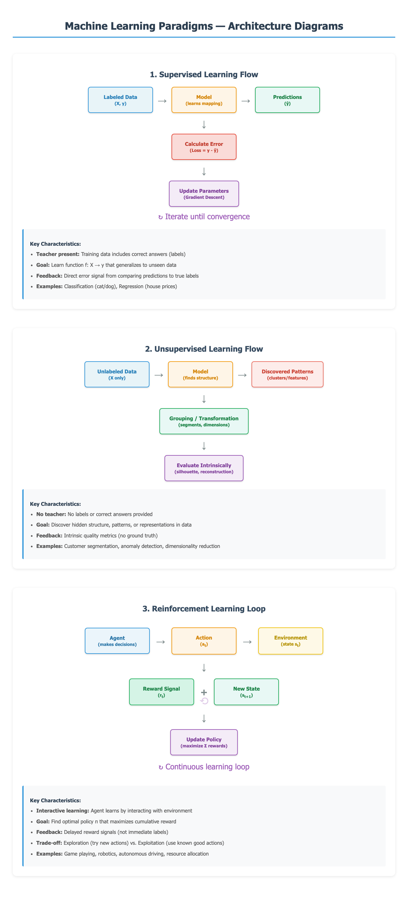

# Machine Learning Paradigms — Cheatsheet
*A comprehensive guide to Supervised, Unsupervised, and Reinforcement Learning*

---

## Overview

Machine learning (ML) is broadly categorized into three paradigms based on how algorithms learn from data:

1. **Supervised Learning** — Learning from labeled examples with a "teacher"
2. **Unsupervised Learning** — Discovering patterns in unlabeled data without guidance
3. **Reinforcement Learning** — Learning through trial-and-error with reward feedback

Each paradigm addresses different types of problems and requires different approaches to training, evaluation, and deployment.

---

## Architecture Diagrams



The diagram above illustrates the fundamental workflow of each paradigm:
- **Supervised:** Labeled data → Model → Predictions → Error → Parameter updates
- **Unsupervised:** Unlabeled data → Model → Patterns/Groupings → Intrinsic evaluation
- **Reinforcement:** Agent → Action → Environment → Reward + New State → Policy update

---

## 1. Supervised Learning

### Intuition / Analogy

**Learning with a teacher.** Imagine studying for an exam with answer keys. You practice problems (input data), check the correct answers (labels), learn from your mistakes (loss/error), and improve over time. When exam day comes (test data), you apply what you learned to new problems.

**Real-world analogy:** A child learning to identify fruits. Parents show pictures and say "this is an apple," "this is a banana." After enough examples, the child can identify fruits they've never seen before.

### Key Concepts

- **Training Data**: Dataset with input features (X) and corresponding labels (y)
- **Features (X)**: Input variables used for prediction (e.g., pixels in an image, words in text)
- **Labels (y)**: Target output/ground truth (e.g., "cat" vs "dog", house price)
- **Model**: Mathematical function f that maps X → y
- **Loss Function**: Measures how wrong predictions are compared to true labels
- **Optimization**: Process of adjusting model parameters to minimize loss
- **Generalization**: Model's ability to perform well on unseen data

### How It Works (Step-by-Step)

1. **Collect & Prepare Data**: Gather labeled dataset, split into train/validation/test sets
2. **Choose Model Architecture**: Select algorithm (linear regression, neural network, etc.)
3. **Initialize Parameters**: Start with random weights/parameters
4. **Forward Pass**: Feed input through model to generate prediction ŷ
5. **Calculate Loss**: Compare prediction ŷ with true label y using loss function
6. **Backward Pass**: Compute gradients of loss with respect to parameters
7. **Update Parameters**: Adjust weights using gradient descent: $w_{new} = w_{old} - \alpha \nabla L$
8. **Repeat**: Iterate steps 4-7 for multiple epochs
9. **Validate**: Check performance on validation set, tune hyperparameters
10. **Test**: Final evaluation on held-out test set

### Key Formulas

**Mean Squared Error (Regression)**:
$$
MSE = \frac{1}{n} \sum_{i=1}^{n} (y_i - \hat{y}_i)^2
$$
- $y_i$: true label for sample $i$
- $\hat{y}_i$: predicted value for sample $i$
- $n$: number of samples

**Cross-Entropy Loss (Classification)**:
$$
L = -\frac{1}{n} \sum_{i=1}^{n} \sum_{c=1}^{C} y_{i,c} \log(\hat{y}_{i,c})
$$
- $C$: number of classes
- $y_{i,c}$: 1 if sample $i$ belongs to class $c$, else 0
- $\hat{y}_{i,c}$: predicted probability for class $c$

**Gradient Descent Update**:
$$
\theta_{t+1} = \theta_t - \alpha \nabla_\theta L(\theta_t)
$$
- $\theta$: model parameters (weights)
- $\alpha$: learning rate
- $\nabla_\theta L$: gradient of loss with respect to parameters

### Key Algorithms

| Algorithm | Type | Use Case | Strengths | Weaknesses |
|-----------|------|----------|-----------|------------|
| **Linear Regression** | Regression | Predict continuous values | Simple, interpretable, fast | Assumes linear relationship |
| **Logistic Regression** | Classification | Binary/multi-class classification | Probabilistic output, interpretable | Linear decision boundary |
| **Decision Trees** | Both | Structured data with rules | Non-linear, interpretable | Prone to overfitting |
| **Random Forest** | Both | Tabular data, feature importance | Reduces overfitting, robust | Slower, less interpretable |
| **Support Vector Machines** | Both | High-dimensional data, small datasets | Effective in high dimensions | Slow on large datasets |
| **Neural Networks** | Both | Complex patterns (images, text) | Highly flexible, powerful | Needs lots of data, black-box |
| **Gradient Boosting** | Both | Structured data competitions | State-of-art on tabular data | Sensitive to hyperparameters |
| **k-Nearest Neighbors** | Both | Simple pattern matching | No training phase, intuitive | Slow prediction, sensitive to scale |

### When to Use / Not Use

| ✅ Use Supervised Learning When | ❌ Avoid When |
|----------------------------------|---------------|
| You have labeled historical data | Labels are unavailable or too expensive |
| Clear input-output relationship exists | You want to discover unknown patterns |
| Prediction accuracy is critical | You have very limited labeled data |
| Problem is classification or regression | Data labeling is subjective or noisy |
| You can validate with ground truth | Real-time learning from environment needed |

### Pros & Cons

| Pros ✅ | Cons ❌ |
|---------|---------|
| Clear objective (minimize loss on labels) | Requires labeled data (expensive/time-consuming) |
| Well-established evaluation metrics | May not discover novel patterns |
| Strong theoretical foundations | Can overfit to training distribution |
| Works well with sufficient labeled data | Struggles with distribution shift |
| Predictable performance | Assumes labels are correct |

### Common Pitfalls

- **Overfitting**: Model memorizes training data but fails on new data
  - *Fix*: Use regularization (L1/L2), dropout, early stopping, more data
- **Underfitting**: Model too simple to capture patterns
  - *Fix*: Increase model complexity, add features, reduce regularization
- **Data Leakage**: Test information bleeds into training
  - *Fix*: Strict train/test split, careful feature engineering
- **Imbalanced Classes**: One class dominates (e.g., 99% negative, 1% positive)
  - *Fix*: Resampling, class weights, SMOTE, different metrics (F1, AUC-ROC)
- **Poor Feature Selection**: Irrelevant or redundant features
  - *Fix*: Feature importance analysis, domain knowledge, dimensionality reduction
- **Not Scaling Features**: Different feature scales confuse model
  - *Fix*: Standardization (z-score), normalization (min-max), robust scaling

### Code Snippet (Scikit-learn)

```python
from sklearn.model_selection import train_test_split
from sklearn.ensemble import RandomForestClassifier
from sklearn.metrics import accuracy_score, classification_report
import numpy as np

# Sample dataset: Iris classification
from sklearn.datasets import load_iris
iris = load_iris()
X, y = iris.data, iris.target

# Split data: 80% train, 20% test
X_train, X_test, y_train, y_test = train_test_split(
    X, y, test_size=0.2, random_state=42, stratify=y
)

# Initialize supervised learning model
model = RandomForestClassifier(n_estimators=100, random_state=42)

# Train model on labeled data
model.fit(X_train, y_train)

# Make predictions
y_pred = model.predict(X_test)

# Evaluate with known labels
accuracy = accuracy_score(y_test, y_pred)
print(f"Accuracy: {accuracy:.3f}")
print("\nClassification Report:")
print(classification_report(y_test, y_pred, target_names=iris.target_names))

# Feature importance (what the model learned)
feature_importance = model.feature_importances_
for name, importance in zip(iris.feature_names, feature_importance):
    print(f"{name}: {importance:.3f}")
```

---

## 2. Unsupervised Learning

### Intuition / Analogy

**Exploring without a map.** Imagine being dropped into a new city without directions or labels. You'd naturally group neighborhoods by similarities—residential areas cluster together, commercial districts form patterns, etc. You discover the city's structure through observation, not by being told what's where.

**Real-world analogy:** Organizing a messy photo library. Without any labels, you'd naturally group photos by visual similarity—vacations together, family events together, work photos together—discovering inherent patterns based on content.

### Key Concepts

- **Unlabeled Data**: Only input features (X), no target labels
- **Clustering**: Grouping similar data points together
- **Dimensionality Reduction**: Reducing number of features while preserving information
- **Density Estimation**: Modeling probability distribution of data
- **Anomaly Detection**: Identifying unusual or outlier data points
- **Latent Features**: Hidden structure or representations learned from data
- **Intrinsic Evaluation**: Quality metrics without ground truth (silhouette, elbow method)

### How It Works (Step-by-Step)

1. **Data Collection**: Gather unlabeled data (no y values needed)
2. **Preprocessing**: Clean, normalize, handle missing values
3. **Choose Algorithm**: Select based on goal (clustering, reduction, etc.)
4. **Feature Extraction**: Transform raw data into useful representations
5. **Model Training**: Algorithm finds patterns, structures, or groupings
6. **Pattern Discovery**: Model outputs clusters, components, or embeddings
7. **Intrinsic Evaluation**: Use internal metrics (silhouette score, reconstruction error)
8. **Interpretation**: Human analyst examines discovered patterns
9. **Validation**: Check if patterns make sense in domain context
10. **Application**: Use discovered structure for downstream tasks

### Key Formulas

**K-Means Objective (Minimize within-cluster variance)**:
$$
J = \sum_{i=1}^{k} \sum_{x \in C_i} ||x - \mu_i||^2
$$
- $k$: number of clusters
- $C_i$: $i$-th cluster
- $\mu_i$: centroid of cluster $i$
- $x$: data point

**Silhouette Score (Cluster quality, -1 to 1, higher is better)**:
$$
s(i) = \frac{b(i) - a(i)}{\max(a(i), b(i))}
$$
- $a(i)$: average distance from point $i$ to other points in same cluster
- $b(i)$: average distance from point $i$ to points in nearest cluster

**Principal Component Analysis (Maximize variance)**:
$$
\text{Cov}(X) = \frac{1}{n} X^T X, \quad \text{find eigenvectors of Cov}(X)
$$
- Principal components are eigenvectors with largest eigenvalues
- Reduced data: $X_{reduced} = X \cdot W_k$ (top $k$ eigenvectors)

### Key Algorithms

| Algorithm | Purpose | Use Case | Strengths | Weaknesses |
|-----------|---------|----------|-----------|------------|
| **K-Means** | Clustering | Customer segmentation | Fast, simple, scalable | Needs k specified, assumes spherical clusters |
| **DBSCAN** | Density clustering | Anomaly detection, arbitrary shapes | Finds outliers, no k needed | Sensitive to parameters, struggles with varying density |
| **Hierarchical** | Tree clustering | Taxonomy creation | No k needed, dendrogram | Slow on large data, not scalable |
| **Gaussian Mixture** | Soft clustering | Probabilistic grouping | Soft assignments, flexible shapes | Slow, needs initialization |
| **PCA** | Dimensionality reduction | Visualization, preprocessing | Fast, interpretable | Linear only, sensitive to scaling |
| **t-SNE** | Visualization | 2D/3D embeddings | Preserves local structure | Slow, non-deterministic, distorts global structure |
| **UMAP** | Visualization | 2D/3D embeddings | Faster than t-SNE, preserves global | Newer, fewer use cases documented |
| **Autoencoders** | Feature learning | Compression, denoising | Non-linear, powerful | Needs tuning, complex training |
| **Isolation Forest** | Anomaly detection | Fraud detection | Fast, effective | Black-box, hard to interpret |

### When to Use / Not Use

| ✅ Use Unsupervised Learning When | ❌ Avoid When |
|------------------------------------|---------------|
| No labels available or too expensive | You have abundant labeled data |
| Want to explore data structure | Specific prediction task with clear output |
| Discovering unknown patterns/segments | Need guaranteed accuracy metrics |
| Preprocessing for supervised learning | Business requires explainable predictions |
| Anomaly detection without known anomalies | Ground truth validation is critical |

### Pros & Cons

| Pros ✅ | Cons ❌ |
|---------|---------|
| No labeling required (saves cost/time) | No objective "correctness" measure |
| Discovers unexpected patterns | Results require human interpretation |
| Good for exploratory data analysis | Difficult to validate quality |
| Scales to large unlabeled datasets | Sensitive to hyperparameters |
| Can find novel insights | May find spurious patterns |

### Common Pitfalls

- **Choosing Wrong K**: Too few/many clusters distorts reality
  - *Fix*: Elbow method, silhouette analysis, domain knowledge
- **Not Scaling Data**: Features with large ranges dominate distance calculations
  - *Fix*: Standardization or normalization before clustering
- **Ignoring Domain Context**: Clusters may be mathematically valid but meaningless
  - *Fix*: Involve domain experts in interpretation
- **Over-interpreting Results**: Patterns might be random or artifacts
  - *Fix*: Cross-validate with different algorithms, check stability
- **Curse of Dimensionality**: High dimensions make distances meaningless
  - *Fix*: Dimensionality reduction before clustering
- **Expecting Perfect Clusters**: Real data is messy, overlapping
  - *Fix*: Accept soft boundaries, consider probabilistic methods

### Code Snippet (Scikit-learn)

```python
from sklearn.cluster import KMeans
from sklearn.decomposition import PCA
from sklearn.preprocessing import StandardScaler
from sklearn.metrics import silhouette_score
import numpy as np
import matplotlib.pyplot as plt

# Sample dataset: Iris (using only features, ignoring labels)
from sklearn.datasets import load_iris
iris = load_iris()
X = iris.data  # No labels used!

# Scale features (important for distance-based algorithms)
scaler = StandardScaler()
X_scaled = scaler.fit_transform(X)

# 1. Dimensionality Reduction with PCA
pca = PCA(n_components=2)
X_reduced = pca.fit_transform(X_scaled)
print(f"Explained variance: {pca.explained_variance_ratio_}")

# 2. Clustering with K-Means
# Find optimal k using elbow method
inertias = []
silhouettes = []
K_range = range(2, 8)

for k in K_range:
    kmeans = KMeans(n_clusters=k, random_state=42, n_init=10)
    kmeans.fit(X_scaled)
    inertias.append(kmeans.inertia_)
    silhouettes.append(silhouette_score(X_scaled, kmeans.labels_))

print(f"Best k by silhouette: {K_range[np.argmax(silhouettes)]}")

# Apply K-Means with k=3
kmeans = KMeans(n_clusters=3, random_state=42, n_init=10)
clusters = kmeans.fit_predict(X_scaled)

print(f"\nSilhouette Score: {silhouette_score(X_scaled, clusters):.3f}")
print(f"Cluster sizes: {np.bincount(clusters)}")

# Visualize clusters in reduced space
plt.figure(figsize=(10, 4))

plt.subplot(1, 2, 1)
plt.scatter(X_reduced[:, 0], X_reduced[:, 1], c=clusters, cmap='viridis', s=50)
plt.title("Discovered Clusters (Unsupervised)")
plt.xlabel("First Principal Component")
plt.ylabel("Second Principal Component")

plt.subplot(1, 2, 2)
plt.scatter(X_reduced[:, 0], X_reduced[:, 1], c=iris.target, cmap='viridis', s=50)
plt.title("True Labels (for comparison)")
plt.xlabel("First Principal Component")

plt.tight_layout()
plt.savefig('unsupervised_clustering.png', dpi=100)
print("\nVisualization saved as 'unsupervised_clustering.png'")
```

---

## 3. Reinforcement Learning

### Intuition / Analogy

**Learning to play a game through practice.** Imagine learning to play chess. You don't have a teacher telling you every move—instead, you try different strategies, sometimes you win (reward!), sometimes you lose (penalty). Over time, you learn which moves lead to victory and adjust your strategy accordingly. You balance trying new moves (exploration) with using moves you know work (exploitation).

**Real-world analogy:** Training a puppy. You don't have labeled "good dog" and "bad dog" photos. Instead, the puppy tries actions (sit, jump, bark), gets treats for good behavior (positive reward), and learns over time which actions lead to treats. The puppy is the agent, you're the environment, and treats are rewards.

### Key Concepts

- **Agent**: Decision-maker (e.g., robot, game player, algorithm)
- **Environment**: World the agent interacts with (e.g., game, physical space)
- **State (s)**: Current situation/observation of environment
- **Action (a)**: Decision agent can make
- **Reward (r)**: Feedback signal (+positive, -negative, 0 neutral)
- **Policy (π)**: Strategy mapping states to actions
- **Value Function V(s)**: Expected cumulative reward from state $s$
- **Q-Function Q(s,a)**: Expected cumulative reward from taking action $a$ in state $s$
- **Episode**: Complete sequence from start to terminal state

### How It Works (Step-by-Step)

1. **Initialize Environment**: Set up problem with states, actions, rewards
2. **Initialize Policy**: Start with random or heuristic policy
3. **Agent Observes State**: Get current state $s_t$ from environment
4. **Agent Selects Action**: Choose $a_t$ based on policy (explore or exploit)
5. **Environment Responds**: Execute action, transition to new state $s_{t+1}$
6. **Receive Reward**: Environment returns reward signal $r_t$
7. **Store Experience**: Save $(s_t, a_t, r_t, s_{t+1})$ in memory
8. **Update Policy**: Adjust strategy to increase expected future rewards
9. **Repeat**: Continue loop for many episodes
10. **Convergence**: Policy improves until optimal strategy found

### Key Formulas

**Cumulative Return (discounted sum of future rewards)**:
$$
G_t = r_t + \gamma r_{t+1} + \gamma^2 r_{t+2} + \cdots = \sum_{k=0}^{\infty} \gamma^k r_{t+k}
$$
- $G_t$: return from time $t$
- $r_t$: reward at time $t$
- $\gamma$: discount factor (0 < $\gamma$ < 1, values future rewards less)

**Bellman Equation (recursive value function)**:
$$
V(s) = \max_a \left[ r(s, a) + \gamma \sum_{s'} P(s'|s,a) V(s') \right]
$$
- $V(s)$: value of state $s$
- $r(s,a)$: immediate reward
- $P(s'|s,a)$: probability of transitioning to $s'$

**Q-Learning Update**:
$$
Q(s_t, a_t) \leftarrow Q(s_t, a_t) + \alpha \left[ r_t + \gamma \max_{a'} Q(s_{t+1}, a') - Q(s_t, a_t) \right]
$$
- $\alpha$: learning rate
- Temporal difference error: $r_t + \gamma \max_{a'} Q(s_{t+1}, a') - Q(s_t, a_t)$

**Policy Gradient (maximize expected return)**:
$$
\nabla_\theta J(\theta) = \mathbb{E}_{\tau \sim \pi_\theta} \left[ \sum_{t=0}^{T} \nabla_\theta \log \pi_\theta(a_t|s_t) G_t \right]
$$
- $\theta$: policy parameters
- $\tau$: trajectory (sequence of states, actions)
- $\pi_\theta$: parameterized policy

### Key Algorithms

| Algorithm | Type | Use Case | Strengths | Weaknesses |
|-----------|------|----------|-----------|------------|
| **Q-Learning** | Value-based | Discrete actions, tabular | Simple, proven | Doesn't scale to large state spaces |
| **Deep Q-Network (DQN)** | Value-based | Atari games, discrete actions | Handles high-dimensional states | Sample inefficient, can be unstable |
| **SARSA** | Value-based | Safe exploration | On-policy, learns safe policy | Slower convergence than Q-learning |
| **Policy Gradients** | Policy-based | Continuous actions | Works with continuous actions | High variance, sample inefficient |
| **Actor-Critic (A2C/A3C)** | Hybrid | Continuous control | Lower variance than PG | More complex to implement |
| **PPO** | Policy-based | Robotics, general RL | Stable, sample efficient | Requires tuning |
| **DDPG** | Actor-Critic | Continuous control | Deterministic policy, efficient | Sensitive to hyperparameters |
| **SAC** | Actor-Critic | Robust control | Maximum entropy, stable | Complex |

### When to Use / Not Use

| ✅ Use Reinforcement Learning When | ❌ Avoid When |
|-------------------------------------|---------------|
| Sequential decision-making problem | One-shot prediction tasks |
| Clear reward signal available | No way to define rewards |
| Agent can interact with environment | Only historical data (use supervised) |
| Need optimal long-term strategy | Immediate predictions needed |
| Continuous learning from feedback | Safety-critical with no room for errors |
| Environment is simulatable | High cost of trial-and-error |

### Pros & Cons

| Pros ✅ | Cons ❌ |
|---------|---------|
| Learns optimal long-term strategies | Requires lots of interactions (sample inefficient) |
| No labeled data needed | Reward engineering can be difficult |
| Adapts to changing environments | Can be unstable during training |
| Discovers novel strategies | Exploration can be dangerous |
| Works with delayed rewards | Slow convergence |

### Common Pitfalls

- **Sparse Rewards**: Agent rarely gets feedback, hard to learn
  - *Fix*: Reward shaping, curriculum learning, intrinsic motivation
- **Reward Hacking**: Agent exploits loopholes instead of intended behavior
  - *Fix*: Careful reward design, human feedback, constraints
- **Exploration-Exploitation Trade-off**: Too much exploration wastes time, too little gets stuck
  - *Fix*: ε-greedy, UCB, entropy regularization
- **Catastrophic Forgetting**: Agent forgets old skills when learning new ones
  - *Fix*: Experience replay, progressive networks
- **Sample Inefficiency**: Needs millions of interactions to learn
  - *Fix*: Model-based RL, transfer learning, better algorithms (PPO, SAC)
- **Non-Stationarity**: Agent changes environment (moving target problem)
  - *Fix*: Target networks (DQN), trust region methods (TRPO, PPO)

### Code Snippet (OpenAI Gym + Q-Learning)

```python
import numpy as np
import gym

# Create environment (CartPole: balance pole on cart)
env = gym.make('CartPole-v1')

# Discretize continuous state space for tabular Q-learning
def discretize_state(state, bins=[10, 10, 10, 10]):
    """Convert continuous state to discrete buckets"""
    state_bins = [
        np.linspace(-4.8, 4.8, bins[0]),
        np.linspace(-4, 4, bins[1]),
        np.linspace(-0.42, 0.42, bins[2]),
        np.linspace(-4, 4, bins[3])
    ]
    discrete = tuple(np.digitize(state[i], state_bins[i]) - 1 for i in range(4))
    return discrete

# Initialize Q-table: Q(state, action)
state_space_size = (10, 10, 10, 10)
action_space_size = env.action_space.n
Q = np.zeros(state_space_size + (action_space_size,))

# Hyperparameters
alpha = 0.1          # Learning rate
gamma = 0.99         # Discount factor
epsilon = 1.0        # Exploration rate
epsilon_decay = 0.995
epsilon_min = 0.01
num_episodes = 1000

# Training loop
rewards_history = []

for episode in range(num_episodes):
    state = env.reset()[0]  # Reset environment
    state = discretize_state(state)
    episode_reward = 0
    done = False
    
    while not done:
        # Epsilon-greedy action selection
        if np.random.random() < epsilon:
            action = env.action_space.sample()  # Explore
        else:
            action = np.argmax(Q[state])  # Exploit
        
        # Take action in environment
        next_state, reward, done, truncated, info = env.step(action)
        next_state = discretize_state(next_state)
        episode_reward += reward
        
        # Q-Learning update
        best_next_action = np.argmax(Q[next_state])
        td_target = reward + gamma * Q[next_state][best_next_action]
        td_error = td_target - Q[state][action]
        Q[state][action] += alpha * td_error
        
        state = next_state
        
        if done or truncated:
            break
    
    # Decay exploration
    epsilon = max(epsilon_min, epsilon * epsilon_decay)
    rewards_history.append(episode_reward)
    
    if episode % 100 == 0:
        avg_reward = np.mean(rewards_history[-100:])
        print(f"Episode {episode}, Avg Reward: {avg_reward:.2f}, Epsilon: {epsilon:.3f}")

print(f"\nTraining complete! Final 100-episode average: {np.mean(rewards_history[-100:]):.2f}")

# Test trained agent
state = env.reset()[0]
state = discretize_state(state)
total_reward = 0

for _ in range(500):
    action = np.argmax(Q[state])  # Use learned policy (no exploration)
    next_state, reward, done, truncated, _ = env.step(action)
    total_reward += reward
    state = discretize_state(next_state)
    
    if done or truncated:
        break

print(f"Test episode reward: {total_reward}")
env.close()
```

---

## Comparison Table

| Aspect | Supervised Learning | Unsupervised Learning | Reinforcement Learning |
|--------|---------------------|----------------------|------------------------|
| **Data** | Labeled (X, y pairs) | Unlabeled (X only) | Sequential interactions |
| **Feedback** | Direct error signal | No feedback | Delayed reward signal |
| **Goal** | Predict labels for new data | Find structure/patterns | Maximize cumulative reward |
| **Learning Style** | Learning from examples | Self-discovery | Trial-and-error |
| **Evaluation** | Accuracy, F1, RMSE, etc. | Silhouette, reconstruction | Cumulative reward, win rate |
| **Training Time** | Moderate | Fast (one pass) | Slow (many episodes) |
| **Data Requirement** | Needs labels (expensive) | No labels needed | Needs environment |
| **Interpretability** | Moderate to high | Moderate | Low (policy is complex) |
| **Examples** | Spam filter, image classifier | Customer segmentation, PCA | Game AI, robotics, trading |
| **Output** | Prediction for input | Clusters, embeddings | Sequence of actions |
| **Best For** | Pattern recognition, prediction | Exploration, grouping | Sequential decision-making |

---

## When to Use Each Approach

### Choose Supervised Learning if:
- You have abundant **labeled data** (or can afford to label it)
- Clear **input → output** relationship exists
- **Prediction accuracy** is the primary goal
- You need **measurable performance** with ground truth
- Problem is **classification** or **regression**

**Example problems:** Email spam detection, medical diagnosis, house price prediction, sentiment analysis, image classification

### Choose Unsupervised Learning if:
- Labels are **unavailable or expensive** to obtain
- Want to **discover hidden patterns** in data
- Need **exploratory analysis** before diving deeper
- **Preprocessing** for supervised learning (dimensionality reduction)
- **Anomaly detection** without known anomalies

**Example problems:** Customer segmentation, gene clustering, anomaly detection, recommendation systems (finding similar items), data compression

### Choose Reinforcement Learning if:
- Problem involves **sequential decision-making**
- Agent can **interact with environment** (simulation or real world)
- Clear **reward signal** exists (even if delayed)
- Need to optimize **long-term outcomes**, not immediate predictions
- Agent must **learn from experience** and improve over time

**Example problems:** Game playing (Chess, Go, Atari), robotics, autonomous driving, resource allocation, trading strategies, dialogue systems

---

## Quick Recap

### Supervised Learning
- **TL;DR**: Learning from labeled examples to predict labels for new data
- **Key Insight**: Minimize prediction error against known ground truth
- **Best Use**: When you have labels and want to predict
- **Remember**: Quality of labels directly impacts model performance

### Unsupervised Learning
- **TL;DR**: Discovering hidden patterns in unlabeled data
- **Key Insight**: No right/wrong answer, interpretability is key
- **Best Use**: Exploration, preprocessing, when labels unavailable
- **Remember**: Results need human interpretation and domain knowledge

### Reinforcement Learning
- **TL;DR**: Learning optimal behavior through trial-and-error with rewards
- **Key Insight**: Balance exploration (try new things) and exploitation (use what works)
- **Best Use**: Sequential decisions with delayed rewards
- **Remember**: Sample efficiency is a major challenge

---

## Related Topics

- **Semi-Supervised Learning**: Mix of labeled and unlabeled data
- **Transfer Learning**: Apply knowledge from one task to another
- **Meta-Learning**: Learning to learn across tasks
- **Active Learning**: Intelligently selecting which data to label
- **Imitation Learning**: Learning from expert demonstrations
- **Multi-Task Learning**: Learning multiple related tasks simultaneously
- **Self-Supervised Learning**: Creating labels from unlabeled data (pretext tasks)
- **Model-Based vs Model-Free RL**: Planning with environment model vs learning directly
- **Online Learning**: Continuously learning from streaming data
- **Federated Learning**: Training on distributed data without centralizing

---

## Summary

All three paradigms are essential tools in the ML practitioner's toolkit:

- **Supervised learning** is your workhorse for prediction tasks with labeled data
- **Unsupervised learning** helps you understand and explore data structure
- **Reinforcement learning** excels at sequential decision-making problems

Often, real-world systems combine multiple paradigms:
- Use **unsupervised** learning for preprocessing (PCA, clustering)
- Apply **supervised** learning for prediction
- Employ **reinforcement** learning for decision-making
- Iterate and improve with continuous feedback

**The key is choosing the right tool for your specific problem, data availability, and business constraints.**

---

*Generated on: 30 May 2026*  
*Cheatsheet Version: 1.0*
